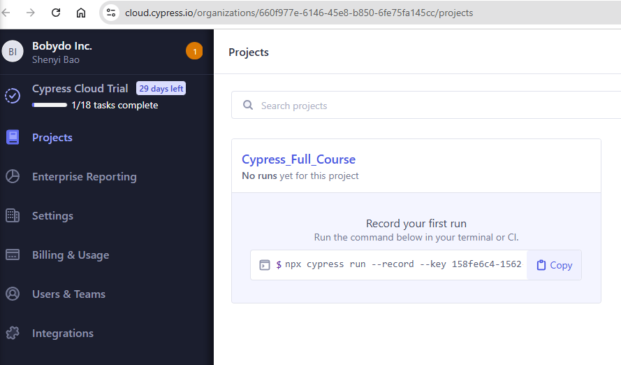

# Cypress Important Concepts

## Do **NOT** Use Variables to Store Cypress Commands

```js
// THIS WILL NOT WORK
const button = cy.get("button")
button.click()
```

**Why?**  
Cypress commands are **asynchronous** and are queued for execution. They do **not** return the actual DOM element, but a "chainable" object. Storing the result in a variable and trying to use it later will not work as expected.

**Correct Usage:**

```js
cy.get("button").click()
```

Or, if you need to work with the yielded subject:

```js
cy.get("button").then(($btn) => {
  // $btn is the actual button element
  // you can interact with it here
})
```

---

## Using `cy.wrap()` for Native DOM Elements

If you need to use a DOM element obtained inside a `.then()` callback or from another source, you must use `cy.wrap()` to bring it back into the Cypress command chain:

```js
cy.get("button").then(($btn) => {
  cy.wrap($btn).click().should("not.have.class", cls)
})
```

**Explanation:**  
- `cy.wrap($btn)` tells Cypress to take the native DOM element (`$btn`) and wrap it so you can continue chaining Cypress commands like `.click()` and `.should()`.
- This is necessary because Cypress commands only work within their own chainable context, not with plain DOM elements.

---

## Assertion Categories in Cypress

1. **not**  
   - Negates an assertion.  
   - Example: `.should('not.equal', 'Jane')`

2. **deep**  
   - Performs deep equality checks for objects.  
   - Example: `.should('deep.equal', { name: 'Jane' })`

3. **nested**  
   - Asserts on nested properties or values.  
   - Example: `.should('have.nested.property', 'a.b[1]')`

4. **ordered**  
   - Checks for ordered members in arrays.  
   - Example: `.should('have.ordered.members', [1, 2])`

5. **any**  
   - Checks if an array/object has any of the specified keys.  
   - Example: `.should('have.any.keys', 'age')`

6. **all**  
   - Checks if an array/object has all of the specified keys.  
   - Example: `.should('have.all.keys', 'name', 'age')`

---

## Cypress 15 AI Assistant Features

1. **Test Generation**
   - AI can generate Cypress test code based on user-provided descriptions or requirements.

2. **Test Debugging**
   - AI Assistant can analyze failing tests and suggest possible fixes or debugging steps.

3. **Code Explanation**
   - AI can explain Cypress test code, helping users understand what each part does.

4. **Test Refactoring**
   - AI can suggest improvements or refactorings for existing test code.

5. **Documentation Integration**
   - AI Assistant can link to relevant Cypress documentation or provide inline explanations.

6. **Interactive Chat**
   - Users can interact with the AI Assistant directly in the Cypress app for real-time help.

7. **Error Analysis**
   - AI can analyze errors and provide context-specific suggestions.

---

These features are designed to make writing and maintaining Cypress tests easier, especially for new users or those troubleshooting complex issues. For more details, see the [Cypress 15 release notes](https://docs.cypress.io/guides/references/changelog).


## New Features
```
npx cypress run --record --key 158fe6c4-1562-4b75-91f7-fc414891604a
```



## Experimental: Recording User Flows with Chrome Recorder

You can use the [@cypress/chrome-recorder](https://github.com/cypress-io/chrome-recorder) tool to convert Chrome DevTools Recorder user flows into Cypress tests.

### Steps:

1. **Install the Chrome Recorder Converter globally:**
   ```bash
   npm i @cypress/chrome-recorder -g
   ```

2. **Export your user flow from Chrome DevTools Recorder as a `.json` file.**

3. **Convert the user flow to Cypress test code:**
   ```bash
   npx @cypress/chrome-recorder cypress/downloads/it_func.json -o=cypress/tests_json
   ```

This will generate Cypress test files from your recorded user flows and save them in the specified output directory.
